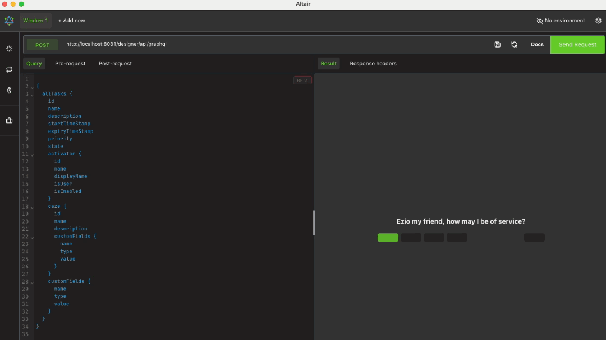

# GraphQL Demo

This Demo provides a GraphQL endpoint running with the Ivy Engine.
The endpoint supports querying tasks and users and allows creating new users.
For more information, see the [GraphQL](https://community.axonivy.com/d/526-graphql) community post.

## Demo

For the following demonstration of sending queries to the endpoint, the [Altair GraphQL Client](https://altairgraphql.dev) is used.
This client is available for most common platforms.
Any other client that can send POST requests can be used instead.

## Setup

No special setup is required on Ivy Engine side.
The GraphQL Resource `com.axonivy.demo.graphql.resource.GraphQLResource` is automatically detected and published by the Ivy Engine.
Then the endpoint is accessible via `http://your-ivy-engine-url/your-application/api/graphql`, e.g. `http://localhost:8081/designer/api/graphql`.

On client side the header `X-Requested-By` must be set, e.g. to `myClient` to make valid POST requests.
