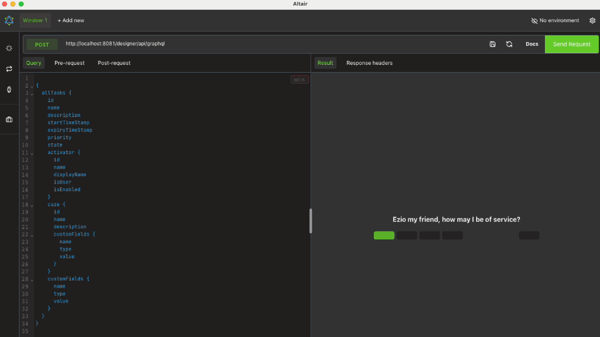

# GraphQL-Demo

Diese Demo bietet einen GraphQL-Endpunkt, der mit der Ivy Engine ausgeführt
wird. Der Endpunkt unterstützt die Abfrage von Aufgaben und Benutzern und
ermöglicht die Erstellung neuer Benutzer. Weitere Informationen finden Sie im
[GraphQL](https://community.axonivy.com/d/526-graphql) Community-Beitrag.

## Demo

Für die folgende Demonstration des Sendens von Abfragen an den Endpunkt wird der
[Altair GraphQL Client](https://altairgraphql.dev) verwendet. Dieser Client ist
für die meisten gängigen Plattformen verfügbar. Stattdessen kann auch jeder
andere Client verwendet werden, der POST-Anfragen senden kann.

  

## Einrichtung

Auf der Ivy Engine-Seite ist keine spezielle Einrichtung erforderlich. Die
GraphQL-Ressource `com.axonivy.demo.graphql.resource.GraphQLResource` wird von
der Ivy Engine automatisch erkannt und veröffentlicht. Der Endpunkt ist dann
über `http://your-ivy-engine-url/your-application/api/graphql` zugänglich, z. B.
`http://localhost:8081/designer/api/graphql`.

Auf der Client-Seite müssen die Header „ `“ und „X-Requested-By“` gesetzt
werden, z. B. auf „ `myClient` “, um gültige POST-Anfragen zu erstellen.
